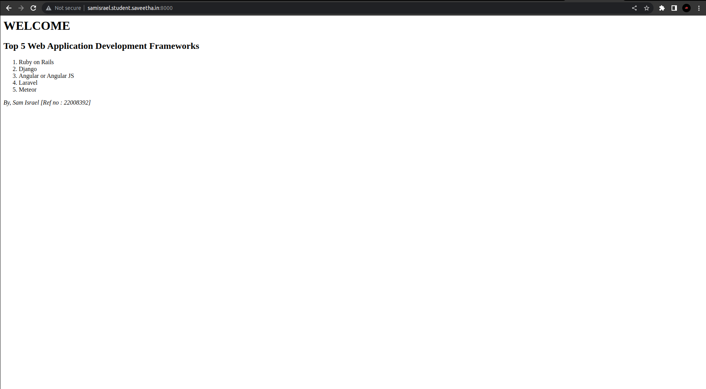

# Developing a Simple Webserver

# AIM:

Develop a webserver to display about top five web application development frameworks.

Name   : Sam Israel
Ref no : 22008392

# DESIGN STEPS:

## Step 1:

HTML content creation is done

## Step 2:

Design of webserver workflow

## Step 3:

Implementation using Python code

## Step 4:

Serving the HTML pages.

## Step 5:

Testing the webserver

# PROGRAM:
```
from http.server import HTTPServer,BaseHTTPRequestHandler

content='''
<html>
<head>
<title>django</title>
</head>
<body>
<h1><b>WELCOME</b></h1>
<h2>Top 5 Web Application Development Frameworks</h2>
<ol>
<li>Ruby on Rails</li>
<li>Django</li>
<li>Angular or Angular JS</li>
<li>Laravel</li>
<li>Meteor</li>
</ol>
<i>By, Sam Israel [Ref no : 22008392]</i>
</body>
</html>
'''

class myhandler(BaseHTTPRequestHandler):
     def do_GET(self):
         print("request received")
         self.send_response(200)
         self.send_header('content-type','text/html; charset=utf-8')
         self.end_headers()
         self.wfile.write(content.encode())
server_address = ('',8000)
httpd = HTTPServer(server_address,myhandler)
print("my webserver is running....")
httpd.serve_forever()
```
# OUTPUT:


# RESULT:

The program is executed succesfully
